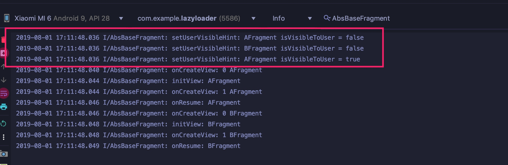
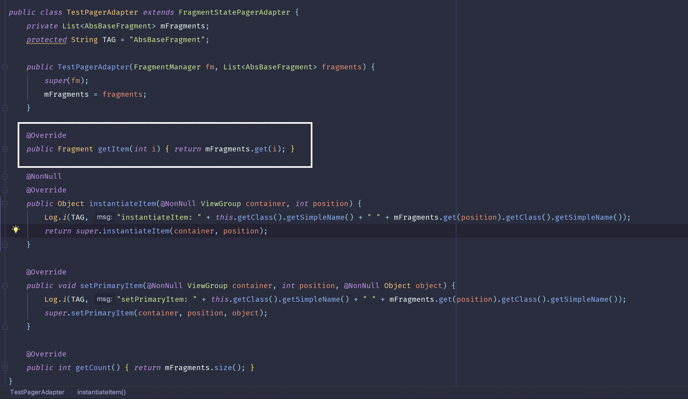
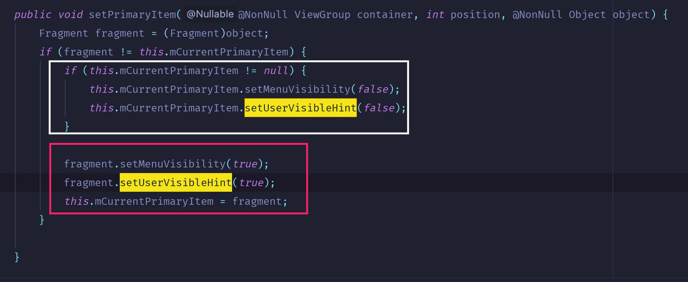
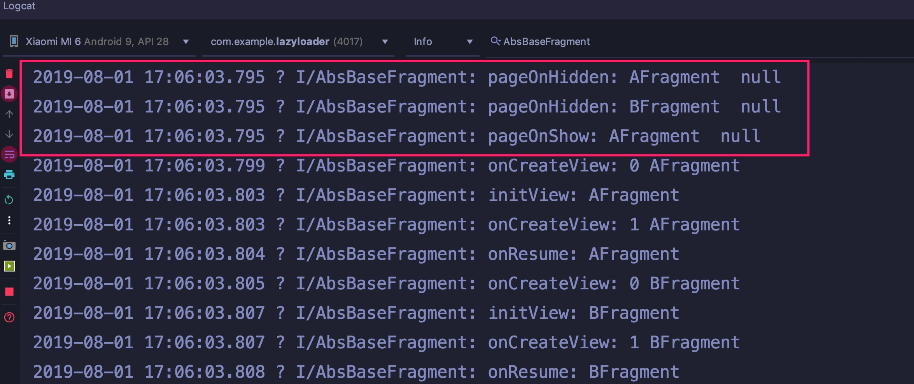
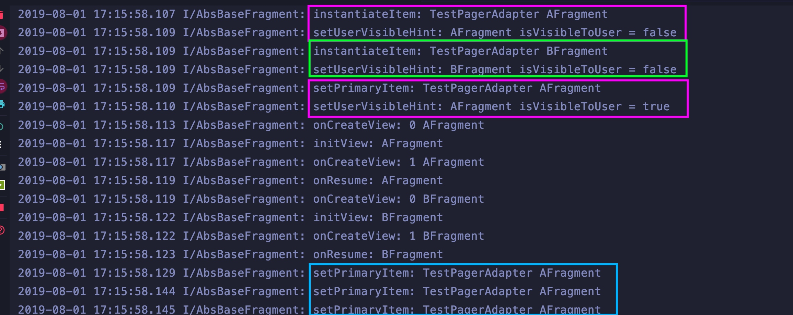

# 1 日志截图


* 该截图是在`mViewPager.setOffscreenPageLimit(int limit);`的参数为`1`的情况下进行的。只缓存一个`BFragment`。
* 此方法在`PagerAdapter`的子类`FragmentStatePagerAdapter`中被调用，也就是只有在在`viewpager`、`PagerAdapter`和`fragment`结合使用的时候，会触发，触发时机下面分析。
* 该方法优先于`onCreateView()`被调用。

# 2 调用时机
*`1`的日志截图只是反映了，`setUseVisibleHint(boolean)`被调用3次了，且优先于`fragment`的`onCreateView()`方法。更详细的信息，需要看源码*

## 2.1 instantiateItem()
在`FragmentPageAdapter`的`instantiateItem(@NonNull ViewGroup container, int position)`中被调用两次。

代码如下：
```java
@NonNull
public Object instantiateItem(@NonNull ViewGroup container, int position) {
    Fragment fragment;
    if (this.mFragments.size() > position) {
        fragment = (Fragment)this.mFragments.get(position);
        if (fragment != null) {
            return fragment;
        }
    }

    if (this.mCurTransaction == null) {
        this.mCurTransaction = this.mFragmentManager.beginTransaction();
    }

    fragment = this.getItem(position);
    if (this.mSavedState.size() > position) {
        SavedState fss = (SavedState)this.mSavedState.get(position);
        if (fss != null) {
            fragment.setInitialSavedState(fss);
        }
    }

    while(this.mFragments.size() <= position) {
        this.mFragments.add((Object)null);
    }

    fragment.setMenuVisibility(false);
    fragment.setUserVisibleHint(false);
    this.mFragments.set(position, fragment);
    this.mCurTransaction.add(container.getId(), fragment);
    return fragment;
} 
```
### 2.1.1  看这一段代码：

```java
Fragment fragment;
if (this.mFragments.size() > position) {
    fragment = (Fragment)this.mFragments.get(position);
    if (fragment != null) {
        return fragment;
    }
}
```
app启动时，`position = 0`,`mFragments.size()==0`(这个地方看源码可以知道)，所以会直接跳过这段代码，走下面的：

```java
if (this.mCurTransaction == null) {
    this.mCurTransaction = this.mFragmentManager.beginTransaction();
}

fragment = this.getItem(position);
if (this.mSavedState.size() > position) {
    SavedState fss = (SavedState)this.mSavedState.get(position);
    if (fss != null) {
        fragment.setInitialSavedState(fss);
    }
}

while(this.mFragments.size() <= position) {
    this.mFragments.add((Object)null);
}

fragment.setMenuVisibility(false);
fragment.setUserVisibleHint(false);
this.mFragments.set(position, fragment);
this.mCurTransaction.add(container.getId(), fragment);
return fragment;
```
此时的`FragmentTransaction`也是`null`,会走这段代码：
```java
this.mCurTransaction = this.mFragmentManager.beginTransaction();
```
然后是，通过`getItem(int pos)`取出一个`fragment`，`getItem(int)`由我们自己实现：



### 2.1.2 剩下的代码中，我们直接看`fragment.setUserVisibleHint(false);`

就是这段代码，将`isVisibleToUser`赋值为`false`,这就是我们懒加载的依据。其实这个时候，我们应该是不加载数据，因为这个时候，视图还没创建，注意前面的说的APP启动，也就是`viewpager`为`fragment`的呈现做的准备工作，即实例化`viewpager`的`item`阶段，比如开启`事务`。

## 2.2 setPrimaryItem()
**这个函数，最主要的调用就是被用户滑动切换`fragment`的时候。**

上图的另外两次调用在`setPrimaryItem(@NonNull ViewGroup container, int position, @NonNull Object object)`中

```java
public void setPrimaryItem(@NonNull ViewGroup container, int position, @NonNull Object object) {
    Fragment fragment = (Fragment)object;
    if (fragment != this.mCurrentPrimaryItem) {
        if (this.mCurrentPrimaryItem != null) {
            this.mCurrentPrimaryItem.setMenuVisibility(false);
            this.mCurrentPrimaryItem.setUserVisibleHint(false);
        }

        fragment.setMenuVisibility(true);
        fragment.setUserVisibleHint(true);
        this.mCurrentPrimaryItem = fragment;
    }

}
```
参数`object`说明一下：我觉得应该是你要切换到的那个`fragment`，比如从`AFragment`切换到`BFragment`,那么`object`就是`BFragment`。

这段代码触发的触发有两种：一是`系统自动调用`，二是`手动`：包括点击和切换。
### 2.2.1 系统触发
系统触发显示默认的要展示的`fragment`，这里指的是`AFragment`。

调用发生在`AFragment`的`onCreateView()`方法之前，对于`AFragment`：走红框部分，而不走白框。因为这个时候变量`fragment`就是`AFragment`，但是`this.mCurrentPrimaryItem`此时为初始值`null`，所以会走红框部分。然后，`this.mCurrentPrimaryItem = fragment;`第一次被赋值，且指向即将可见的`AFragment`。



* 白框部分：系统的调用时候，`this.mCurrentPrimaryItem`是初始值`null`，不会走。其他情况出发都会走。并且走白框的时候，就是发生切换的时候,切换是走进这个`if语句`的前提，当然是除了`系统第一次调用这个函数的时候`。
* 红框部分：是的`this.mCurrentPrimaryItem`指向即将可见的`fragment`。


但是，这个时候，依然没有去创建视图。所以会出现这样的情况：


### 2.2.2 点击
点击的时候，只走一行代码，`Fragment fragment = (Fragment)object;`；

因为点击的时候，`object`没有发生改变，指向当前`fragment`，`this.mCurrentPrimaryItem`也指向当前`fragment`。

### 2.2.3 切换
切换的时候，会走完这代码块的所有代码：


* 白框部分将即将被切换掉的`fragment`设置为对用户不可见。
* 红框部分将即将可见的`fragment`设置为对用户可见。同时，将`this.mCurrentPrimaryItem`指向即将可见的`fragment`。

## 2.3 最终的日志

# 3 demo地址
[LazyLoader](https://github.com/XBean1024/LazyLoader)
